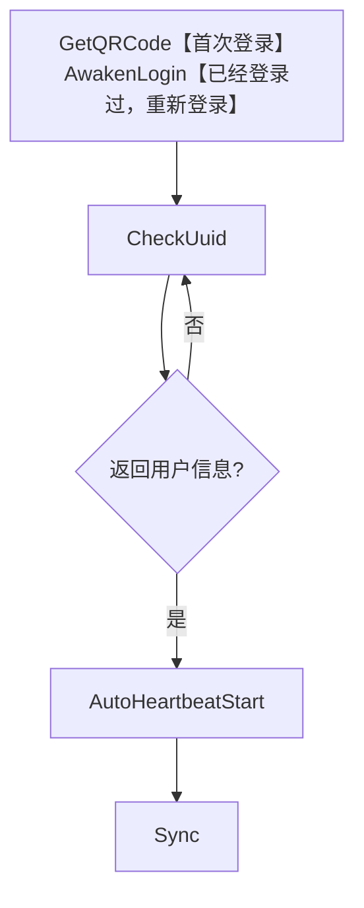

### 如何使用
```yaml
services:
  XYBotV2:
    container_name: xybot
    image: lxh01/xybotv2:latest
    restart: unless-stopped
    ports:
      - "9000:9000"
    environment:
      - REDIS_HOST=10.0.0.31
      - REDIS_PASSWORD=password
      - REDIS_DB=2

```
~~运行起来之后，直接浏览器打开`http://{your_ip}:9000`就可以看到接口文档了。~~  
新版本没得swagger了，可以看这个: [接口文档](https://apifox.com/apidoc/shared-33d5384e-836d-4046-92c0-6c124f96176b)

### 注意事项
返回码说明 0:正常 -1:参数错误 -2:其他错误 -3:序列化错误 -4:反序列化错误 -5:MMTLS初始化错误 -6:收到的数据包长度错误 -7:已退出登录 -8:链接过期 -9:解析数据包错误 -10:数据库错误 -11:登陆异常 -12:操作过于频繁 -13:上传失败  
新设备登录 24 小时（1天）内不能发送朋友圈，部分账号 72 小时（3天）内不能发朋友圈，如发送朋友圈手机会收到安全告警。  
为了账号稳定，推荐登录新设备后进行 3 - 5 小时的挂机养号操作，在此时间段内限制或者禁止操作，以提高设备的稳定性，可以避免很多风控。  
主动添加好友单天上限为 15 个，扫码方式添加和通过好友请求上限为 25 个，1 小时内上限为 5 个，超过上限时，无法发出好友请求，也收不到好友请求。  
本项目仅供学习交流使用，不得用于商业用途，违者后果自负。

### 登录流程

如果是首次登录，需要调用`GetQRCode`接口获取二维码扫码，如果已经登录过，可以直接调用`AwakenLogin`接口。  
获取二维码接口，如果不需要设置代理，相关参数可以直接不传。  
`CheckUuid`接口用于检查是否已经扫码，如果已经扫码，会返回用户信息。  
`AutoHeartbeatStart`接口用于开启自动心跳，如果不喜欢，也可以手动轮询`/Heartbeat`接口。  
`Sync`接口用于同步消息，需要一直轮询，如果账号已退出，该接口也会有返回`Error：用户可能退出`。

### 更新日志
版本 | 日志
---|---
20250217 | fix: 发送视频报错，视频消息不应该堵塞。
20250220 | fix: 修复无法设置 Redis 的 BUG。
